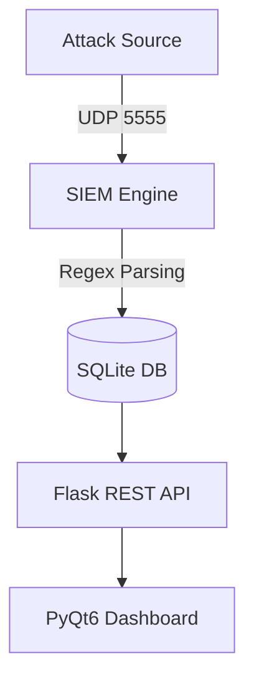

# SOC-SIEM PRO

SOC-SIEM PRO is an end-to-end Security Information and Event Management (SIEM) solution designed for Security Operations Centers (SOCs). The system ingests logs in real time via UDP, utilizes a hybrid detection framework combining signature-based analytics and Machine Learning anomaly scoring, enriches threat vectors using external intelligence APIs, automates incident mitigation (such as IP banning and email notifications), and centralizes operational oversight within a modern, secure PyQt6 graphical interface.

---

## Key Features

* **Synchronous Network Ingestion Engine:** A native UDP listener component (`siem_listener.py` / `start.py`) designed to ingest, decode, and deduplicate complex Syslog streams on the fly via port `5555`.
* **Hybrid Attack Detection Framework:**
  * *Signature-Based Analytics:* Immediate syntax analysis designed to identify explicit threats including Brute Force, Port Scans, SQL Injections, Distributed Denial of Service (DDoS), and Malware footprints.
  * *Machine Learning Anomaly Scoring:* An unsupervised Machine Learning model that evaluates event volume and structural patterns on a per-IP basis to flag zero-day vectors or stealthy maneuvers.
* **Heuristic Analysis Component:** A dedicated contextual evaluation sub-system that computes threat scores based on historical alert trends within a sliding time window and structural log indicators.
* **Security Orchestration, Automation, and Response (SOAR):**
  * Automated block implementation executed at both the database level and GUI runtime to restrict malicious IPs immediately.
  * Extensible rule-based system stored in the database to trigger targeted actions like `block` or `email` based on custom severity or volume criteria.
  * Inherent cooldown logic for email alerts to mitigate notification fatigue during high-volume event floods.
* **Asynchronous Malware Sandboxing:** Automated extraction of observables (URLs, SHA-256, SHA-1, and MD5 hashes) from raw logs for asynchronous submission to sandboxing environments like Cuckoo Sandbox or Litterbox.
* **Threat Intelligence Enrichment:** Multi-threaded integration with the AbuseIPDB API to gather threat confidence scores, geographical origin, Internet Service Provider (ISP) profiles, domain ownership, and historical reporting trends.
* **SOC Administrative Console:** A comprehensive PyQt6 dashboard equipped with a secure user authentication portal, leveraging modern credential hashing with backward compatibility for legacy SHA-256 signatures, alongside temporary account lockouts following consecutive failed login attempts.
* **REST Integration API (Flask):** Administrative Flask endpoints protected via API keys (`X-API-Key`) that facilitate the management of logged incidents, real-time extraction of blocklists, and direct polling of enriched threat intelligence.

---

## Core Artificial Intelligence and Machine Learning Architecture

SOC-SIEM PRO blends statistical analysis, unsupervised learning, and stateful behavioral heuristics to minimize false positives and enhance threat detection capabilities.

### 1. Machine Learning Engine: Isolation Forest (`core/detector.py`)
* **Core Algorithm:** The system utilizes the `IsolationForest` algorithm from *scikit-learn* to mathematically isolate anomalous behavior, such as abnormal event density or sequence variations.
* **Dynamic Pipeline Training:** Event vectors (comprising event type, severity indexes, rolling count window values, and structural network indicators) are loaded into a shifting training cache.
* **Execution Thresholds:** Optimization updates trigger automatically for every 20 new samples once a strict minimum threshold of 30 historical samples (`MIN_SAMPLES`) is satisfied within the training buffer, which enforces a cap of 2000 total instances. If insufficient data is collected for a specific IP (history size < 2), the system uses a statistical standard-deviation fallback.
* **Persistence Layer:** Models are cross-serialized onto local storage (`iforest_model.pk1`) via `joblib` to maintain state, behavioral baselines, and profiling accuracy across application restarts.

### 2. Analytical Heuristics Engine (`core/ai_analyzer.py`)
* **Threat Calculation Matrix:** Calculates an base threat rating determined by signature match severity (e.g., CRITICAL yields 78 points, HIGH yields 55 points).
* **Stateful Temporal Tracking:** Monitors incoming threat velocities using a circular double-ended queue (`deque`):
  * Metrics matching or exceeding 8 events in 60 seconds append **+18 points**.
  * Metrics matching or exceeding 20 events in 5 minutes append **+15 points**.
* **High-Risk Term Heuristics:** Applies penalty points if precise high-risk syntax is identified inside raw log inputs (e.g., *ransomware* [+25], *c2* [+20], *union select* [+18]).
* **Automated Mitigation Triggers:** When combined threat assessments (Heuristics + ML Anomaly scores where the index exceeds 2.5) scale past the configured global constraint (defaulting to `SOC_AUTO_BLOCK_SCORE = 90`), the system executes a protective automated ban sequence.

---

## Project Structure

```text
├── backend/
│   └── api.py                   # Flask Server: Administration endpoints (incidents, blocklists)
├── core/
│   ├── detector.py              # ML Engine (Isolation Forest) and signature parsing logic
│   ├── ai_analyzer.py           # Heuristic assessment, threat profiling, and mitigation triggers
│   ├── schema.py                # Database migrations and schema lifecycle management
│   └── parser.py                # Syslog parsing and ingestion subsystem
├── gui/
│   ├── app.py                   # Main View: PyQt6 SOC Management Interface (SOCDashboard)
│   └── tests/
│       └── test_regressions.py  # Unit verification and regression testing suites
├── threat_intel.py              # AbuseIPDB API orchestration and local caching layer (24h)
├── responder.py                 # SOAR workflow management (Rules, Notification routing, Blocklists)
├── sandbox_integrations.py      # Asynchronous artifact submission pipelines (Cuckoo/Litterbox)
├── siem_listener.py             # Standalone production UDP syslog ingestion service
├── start.py                     # Monolithic startup orchestration (UDP Ingestion + Flask API + PyQt6 GUI)
└── test_siem.py                 # Multi-vector adversarial emulation and attack simulator
## Run

### 1. Install
```bash
pip install -r requirements.txt
```

### 2. Optional Environment
```bash
set ABUSEIPDB_API_KEY=your_abuseipdb_key
set SOC_ADMIN_PASSWORD=choose_a_strong_admin_password
```

If `SOC_ADMIN_PASSWORD` is not set on a fresh database, `start.py` creates the
`admin` user with a generated one-time password and prints it in the console.

### 3. Start The Integrated App
```bash
python start.py
```

This starts the UDP listener, Flask API, login screen, and dashboard together.

### 4. Login
```bash
username : admin
password : admin123
```

### 5. Send Demo Events
```bash
python test_siem.py
```

## System Architecture

