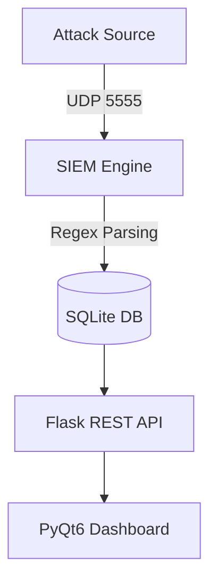

# SOC SIEM PRO (PyQt6 + Flask)

## Features
- Real-time UDP log ingestion
- Rule-based detection plus anomaly scoring
- SQLite incident database
- Flask REST API
- PyQt6 SOC dashboard
- Login screen with hashed credentials
- Blocklist, responder rules, email alerts, and PDF reports
- AbuseIPDB enrichment when `ABUSEIPDB_API_KEY` is set
- Attack simulation script

## Run

### 1. Install
```bash
pip install -r requirements.txt
```

### 2. Optional Environment
```bash
set ABUSEIPDB_API_KEY=your_abuseipdb_key
set SOC_ADMIN_PASSWORD=choose_a_strong_admin_password
```

If `SOC_ADMIN_PASSWORD` is not set on a fresh database, `start.py` creates the
`admin` user with a generated one-time password and prints it in the console.

### 3. Start The Integrated App
```bash
python start.py
```

This starts the UDP listener, Flask API, login screen, and dashboard together.

### 4. Send Demo Events
```bash
python test_siem.py
```

## System Architecture

